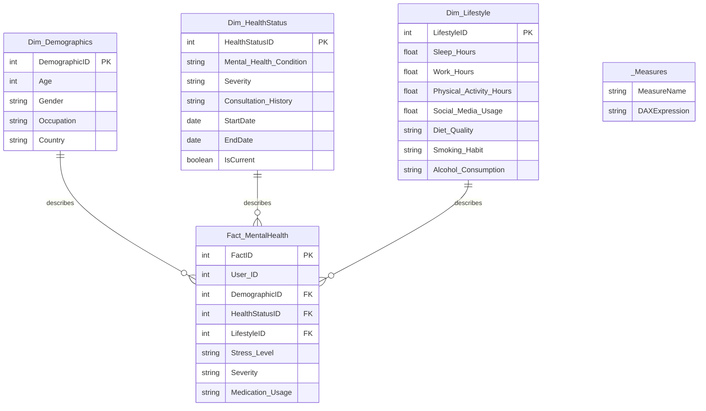

# MindSight — Mental Health & Lifestyle Analysis

A data analytics project exploring the relationship between everyday lifestyle habits and self-reported mental health, built end-to-end from raw data to an interactive Power BI dashboard.

## Overview

MindSight analyzes a synthetic **Mental Health & Lifestyle Habits** dataset of 50,000 respondents. The project follows a complete analytics pipeline: business understanding and statistical profiling of the raw data, an ETL process that structures the data into a star-schema data warehouse, and a multi-page interactive Power BI dashboard for exploration and reporting.

## Objectives

- Analyze mental health and lifestyle data
- Design and build a data warehouse using a star schema
- Perform the ETL process using SSIS
- Identify patterns and trends related to mental health and lifestyle
- Support data-driven decision-making through meaningful insights

## Target Audience

| Audience | Why It Matters to Them |
|---|---|
| Healthcare Professionals | Monitor mental health indicators, stress levels, sleep patterns, and lifestyle habits |
| Researchers | Explore relationships between demographics, lifestyle, and mental health conditions |
| HR Departments & Organizations | Understand work-related factors like working hours and stress |
| Public Health Organizations & Decision Makers | Track population-level trends and support public health planning |

## Dataset

| Metric | Value |
|---|---|
| Source | Kaggle |
| Total Records | 50,000 |
| Total Variables | 17 |
| Missing Demographic Values | None |
| Duplicate Records | None |
| Age Range | 18 – 65 years |
| Respondents Reporting a Condition | 24,997 (50.0%) |

**Main attributes:**
- **Demographics:** Age, Gender, Occupation, Country
- **Lifestyle Habits:** Sleep Hours, Work Hours, Physical Activity, Social Media Usage, Diet Quality, Smoking Habit, Alcohol Consumption
- **Mental Health Indicators:** Mental Health Condition, Severity, Consultation History, Stress Level, Medication Usage

> Statistical testing (chi-square / Pearson correlation) found no significant relationship between any lifestyle/demographic variable and mental health condition — the dataset is best suited for descriptive analytics, dashboarding, and data engineering practice rather than predictive modeling.

## Tech Stack

| Layer | Tools |
|---|---|
| Data Cleaning & ETL | SQL Server Integration Services (SSIS), Power Query |
| Data Warehouse | Star Schema (SQL Server) |
| Modeling & DAX | Power BI |
| Dashboarding | Power BI |

## Data Architecture

The data warehouse follows a **star schema**:

| Table | Type | Purpose |
|---|---|---|
| `Fact_MentalHealth` | Fact | Central table of measurable respondent-level data |
| `Dim_Demographics` | Dimension | Age, Gender, Occupation, Country |
| `Dim_HealthStatus` | Dimension (SCD) | Mental_Health_Condition, Severity, Consultation_History |
| `Dim_Lifestyle` | Dimension | Sleep, Work Hours, Physical Activity, Social Media, Diet, Smoking, Alcohol |
| `_Measures` | Measures table | Holds all DAX measures used in the dashboard |

`Dim_HealthStatus` is maintained as a **Slowly Changing Dimension (SCD)** via an SSIS Data Flow (Flat File Source → Data Conversion → Derived Column → SCD → OLE DB Command / Union All → Insert Destination), so changes to a respondent's health status are tracked as history rather than overwritten.

### Schema Diagram (ERD)

> Renders automatically on GitHub, GitLab, and most Markdown viewers that support Mermaid. `Dim_HealthStatus` includes `StartDate`, `EndDate`, and `IsCurrent` since it's modeled as a Slowly Changing Dimension (SCD). `_Measures` is a standalone table (no relationships) that only holds DAX measure definitions.

## Dashboard Pages

1. **Overview** — top-level KPIs (average age, total patients, heavy smoker %, insomnia rate, average work hours), patients by country/stress level, age-group distribution, world map
2. **Lifestyle Analysis** — sleep, stress, burnout risk, social media usage, diet quality, smoking by age group
3. **Lifestyle Details** — sleep/work hours by gender, mental health condition by occupation, stress by age group
4. **Health Status** — severity distribution, medication usage %, consultation counts, smoking by severity

## Key Insights

- Average sleep duration is **7.01 hours**; most patients sleep 8+ hours
- **33.41%** of participants report high stress
- Burnout risk stands at **7.85%**
- Average social media usage is **3.27 hours/day**
- The **40–59** age group shows the highest stress levels and smoking rates
- Sleep duration is stable across age groups and genders
- Age relates more strongly to stress than gender; occupation shows only small differences in mental health distribution
- Nearly **25,000** patients required a mental health consultation; medication usage stays close to 50% across all severity levels

## Project Timeline & Team

| Week | Focus | Owner(s) |
|---|---|---|
| 1 | Business Understanding | Hana Mohamed Elgawish |
| 2 | Data Engineering | Malak Ahmed Helmy Ibrahim & Maryam Ahmed Elsayed |
| 3 | Data Cleaning & Data Modeling | Mayar Abdelrassoul Mahmoud |
| 4 | Dashboard Development & Storytelling | Malak Ibrahim Abdo & Rawan Mousa Alwani |

## Team Members

- Hana Mohamed Elgawish
- Malak Ahmed Helmy Ibrahim
- Maryam Ahmed Elsayed
- Mayar Abdelrassoul Mahmoud
- Malak Ibrahim Abdo
- Rawan Mousa Alwani

## Conclusion

Mental health in this dataset is shaped by a mix of demographic, lifestyle, and health-related factors rather than any single predictor. The project delivers a complete BI workflow — from raw data, through a star-schema warehouse with a properly maintained SCD, to a decision-ready, multi-page Power BI dashboard — supporting healthcare professionals, researchers, HR teams, and public health decision-makers.
